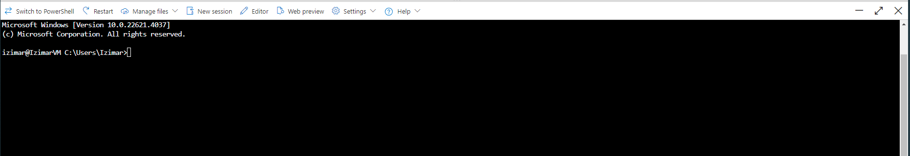

# Setting up SSH on an Azure Windows VM and Detecting Successful Login Attempts Using Azure Sentinel

## Objective

To configure SSH access on a Windows Virtual Machine hosted on Azure and integrate it with Azure Sentinel for monitoring and detecting successful login attempts.

---

   

### These are the commands used on Azure CLI to properly configure SSH on a Windows machine
<ul class="no-bullets">
<li> [ ~ ]$ myResourceGroup=Izimar_Group </li>
<li> [ ~ ]$ myVM=IzimarVM </li>
<li> [ ~ ]$ az vm extension set --resource-group $myResourceGroup --vm-name $myVM --name WindowsOpenSSH --publisher Microsoft.Azure.OpenSSH --version 3.0 </li>
</ul>

   

My resource group variable needed an underscore due to the value containing a space.
If you run into this issue, make sure the value of the variable has an underscore in place of
the space. If your resource group name is "My Resource", then your variable declaration will
look like this in bash: myResourceGroup=My_Resource

---

   

### This screenshot shows OpenSSH being successfully added to IzimarVM machine

---

   

### Created SSH Rule in firewall to allow SSH login from my home IP

---

   

### This screenshot shows a successful SSH connection to IzimarVM

---

   

### Created rule to alert when SSH in used to access machine

---

   

### This screenshot shows the incident created from my sucessful SSH login

---

   

## Outcome

The successful setup will provide secure SSH access to the Windows VM and enable real-time monitoring and detection of successful login attempts using Azure Sentinel, enhancing the overall security and visibillity of the VM environment. Creating an alert for successful SSH login attempts is not very practical unless you also monitor for anomolies such as an unrecognized source IP, Geolocation, or time of day. This project was created as a quick example of setting up and monitoring SSH.

   

[back](./)

   

   

