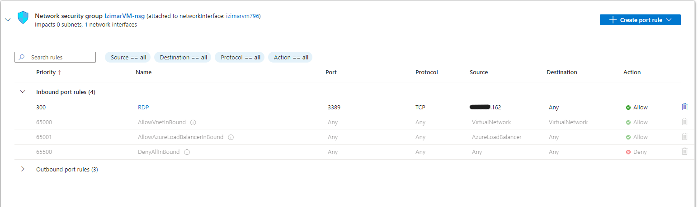

# Setting up SSH on an Azure Windows VM and Detecting Successful Login Attempts Using Azure Sentinel

## Objective

This project involves configuring SSH access on a Windows Virtual Machine hosted on Azure and integrating it with Azure Sentinel for monitoring and detecting suceessful login attempts.
---

   

### These are the commands used on Azure CLI to properly configure SSH on a Windows machine
<ul class="no-bullets">
<li> [ ~ ]$ myResourceGroup=Izimar_Group </li>
<li> [ ~ ]$ myVM=IzimarVM </li>
<li> [ ~ ]$ az vm extension set --resource-group $myResourceGroup --vm-name $myVM --name WindowsOpenSSH --publisher Microsoft.Azure.OpenSSH --version 3.0 </li>
</ul>

   

My resource group variable needed an underscore due to the value containing a space.
If you run into this issue, make sure the value of the variable has an underscore in place of
the space. If your resource group name is "My Resource", then your variable declaration will
look like this in bash: myResourceGroup=My_Variable

---

   

### This screenshot shows OpenSSH being successfully added to IzimarVM machine

---

   

### Created SSH Rule in firewall to allow SSH login from my home IP

---

   

### This screenshot shows a successful SSH connection to IzimarVM

---

   

### Created rule to alert when SSH in used to access machine

---

   

### This screenshot shows the incident created from my sucessful SSH login

---

   

## Defense and Hardening

RDP is a commonly used protocol for accessing machines remotely. A good way to harden a device against unauthorized access would be to only allow white listed IPs to access a machine via RDP.

   

In this screenshot, the updated RDP rule only allows RDP access from one IP address to any device in the network.

Still, there are several instances where this hardening technique will not be so effective:
1. A machine with a white listed IP address becomes compromised, bypassing our Firewall rule.
2. A motivated attacker uses IP spoofing to impersonate a white listed IP address.

   

In these cases, it would be ideal to have an EDR solution on the target machine to monitor the activity of any users that access the device. As always, having a strong password is a great way to deter bad actors.

---

   

## Outcome

The project successfully implemented a robust monitoring solution for RDP logins using Azure Sentinel in the home lab environment. The created alerts provide real-time visibility into RDP access activities, allowing for prompt detection of potential unauthorized access and enhancing overall security posture. This setup not only improves monitoring capabilities but also serves as a practical demonstration of cloud-native security tools.

   

[back](./)

   

   

