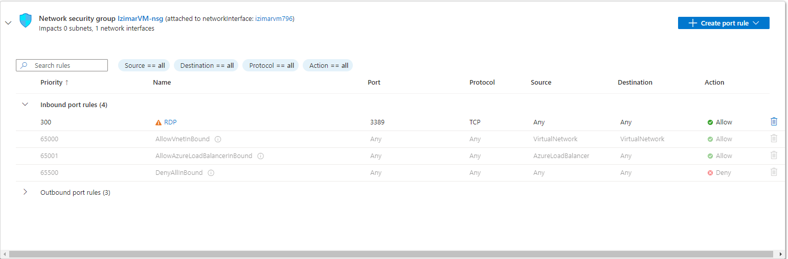
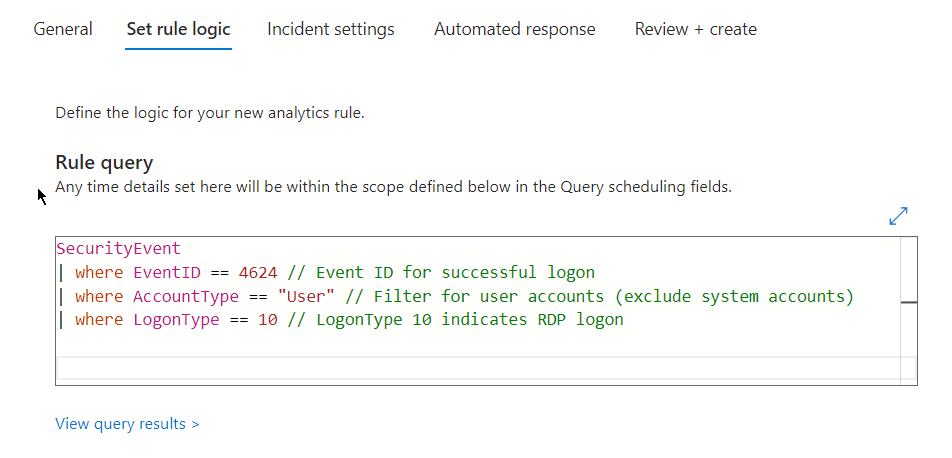
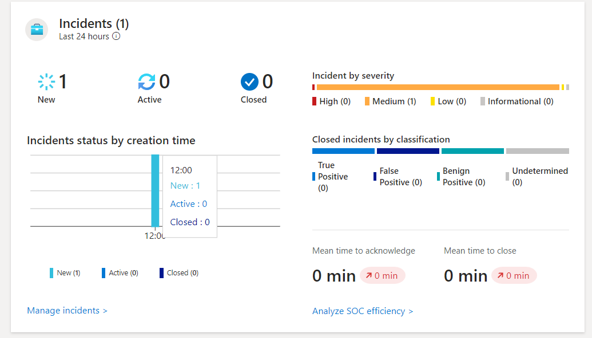
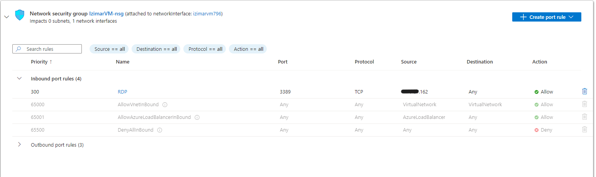

# Azure Sentinel Alert for RDP Login Monitoring in a Home Lab

## Objective

To implement a comprehensive monitoring solution using Azure Sentinel within a home lab environment, focusing on detecting and alerting RDP (Remote Desktop Protocol) logins. The project aimed to enhance security visibility by creating an alert that triggers whenever an RDP login occurs, enabling timely responses to potential unauthorized access attempts.

---

   

### Created a firewall rule to allow all inbound traffic to RDP. RDP is a very common attack vector, and this is not recommended in any serious setting.

---

   

### Created a rule in Azure Sentinel for monitoring a user login via RDP

---

   

### Azure Sentinel was able to detect my successfull RDP login

---

   

## Defense and Hardening

RDP is a commonly used protocol for accessing machines remotely. A good way to harden a device against unauthorized access would be to only allow white listed IPs to access a machine via RDP. 

Still, there are several instances where this hardening technique will not be so effective:
1. A machine with a white listed IP address becomes compromised, bypassing our Firewall rule.
2. A motivated attacker uses IP spoofing to impersonate a white listed IP address.

   

In these cases, it would be ideal to have an EDR solution on the target machine to monitor the activity of any users that access the device. As always, having a strong password is a great way to deter bad actors.

---

   

## Outcome

The project successfully implemented a robust monitoring solution for RDP logins using Azure Sentinel in the home lab environment. The created alerts provide real-time visibility into RDP access activities, allowing for prompt detection of potential unauthorized access and enhancing overall security posture. This setup not only improves monitoring capabilities but also serves as a practical demonstration of cloud-native security tools.

[back](./)
